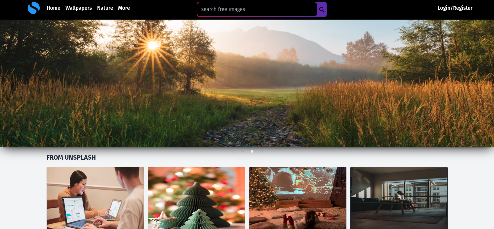
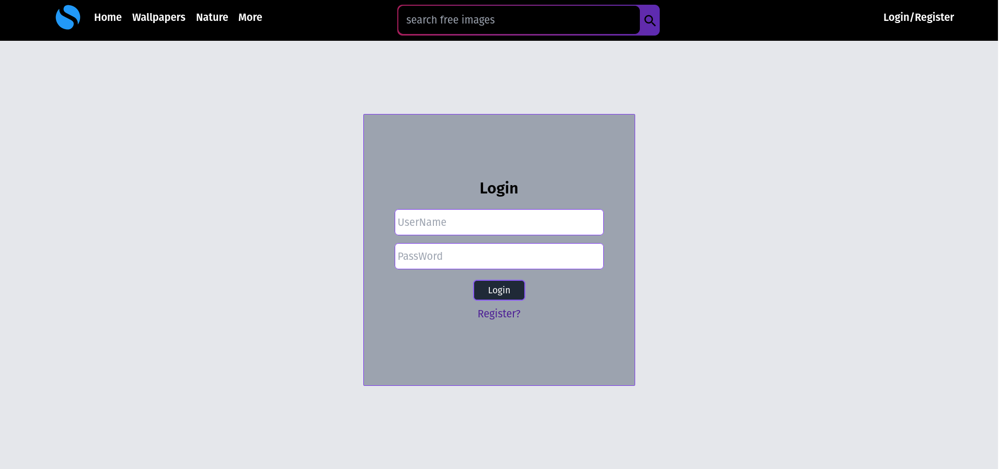
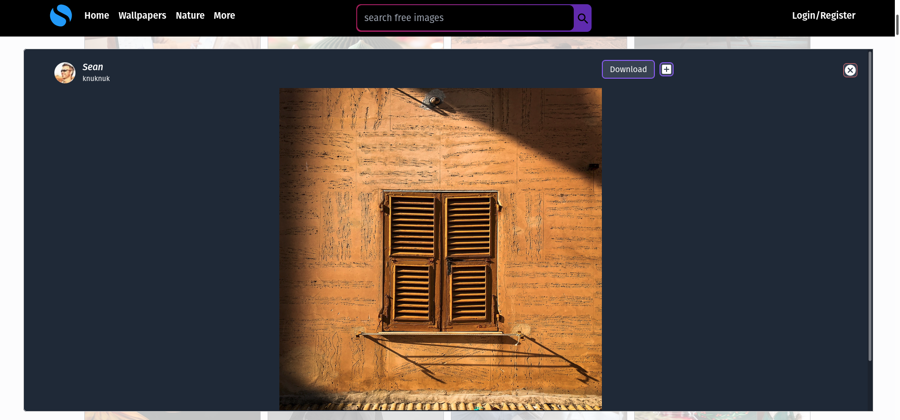

# ImageScraper

A full-stack application that scrapes images form Pixabay & Unsplash API. This web application has been built from ground up. From login system to saving of images, everything has been built from scratch. Used _TypeScript_ as primary language for both front & backend. Note that this application has been built for learning and practice purposes. More details below.

## backend

---

Technologies Used:

_TypeScript_

_PostgreSQL_

_Graphql_

_Node_

_Express_

_TypeORM_

_Redis_

To get the backend running:

Make sure to have PostgreSQL installed. Create a database, and put database name and user credentials inside the _con function_ inside _index.ts_ file.

Also make sure to have two tables created named Image & User.

In the project directory, run below commands.

_Install all modules:_

### `npm install or yarn`

_Run the server or start the application :_

Converts TypeScript files to JavaScript

### `yarn watch`

Run Server:

### `yarn dev`

## Frontend

---

Simple UI built with React. Allows login functionality, saves the user in the database. Users have the ability to download, view, search or save image to their personal collection.

This project is built using React, Next.js, TailwindCSS & Styled Components. Other mentions : material-ui, urql, axios, etc.

_Install all modules:_

### `npm install or yarn`

_Run the server or start the application_

### `yarn dev`

## Preview

---

This application is by no means perfect. Its created for learning purposes.
